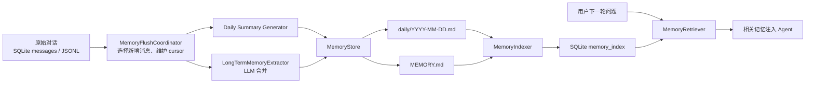
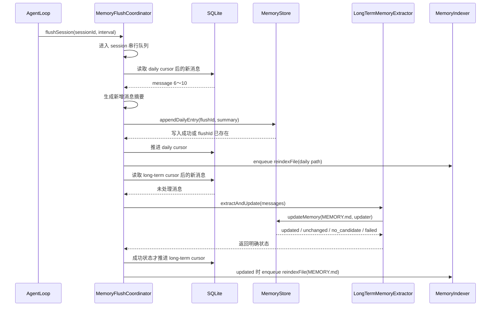

# little_claw Memory / Context 一致性改造方案

## 1. 背景与组件职责

### 1.1 数据目录

系统继续使用以下目录：

```text
~/.little_claw/
├── memory/
│   ├── MEMORY.md
│   ├── inbox.md
│   └── daily/
│       └── YYYY-MM-DD.md
├── context-hub/
│   ├── 2-areas/
│   ├── 3-projects/
│   ├── 4-knowledge/
│   └── 5-archive/
└── logs/
    └── conversations/
        └── YYYY-MM-DD.jsonl
```

这些文件的定位是：

- `MEMORY.md`：用户身份、长期偏好、长期协作事实。
- `inbox.md`：待整理的记忆候选和提醒。
- `daily/*.md`：当天的决定、完成事项、问题和工作摘要。
- `logs/*.jsonl`：原始对话流水，只用于审计和回放。
- `context-hub`：项目、领域和知识资料。
- SQLite：只保存搜索索引和处理状态，不是真相源。

### 1.2 代码组件

| 组件 | 类型 | 职责 |
|---|---|---|
| Markdown 文件 | 真实数据 | 保存最终记忆内容 |
| `MemoryStore` | 文件管理组件 | 创建、迁移、读取、追加和覆盖 Memory 文件 |
| `LongTermMemoryExtractor` | LLM 整理组件 | 从新增对话中提取长期事实，合并进 `MEMORY.md` |
| `MemoryIndexer` | 索引构建组件 | 读取 Markdown，切 chunk、提取关键词、生成 embedding、写 SQLite |
| `MemoryRetriever` | 检索组件 | 从 SQLite 执行 BM25 和向量搜索 |
| `MemoryFlushCoordinator` | 新增流程组件 | 判断处理范围、维护 cursor、控制串行和重试 |
| `MemoryManager` | Agent 上层入口 | 向 AgentLoop 提供加载、recall 和 flush 接口 |
| `ContextHub` | Context 文件组件 | 管理项目、领域和知识文件 |
| `ContextIndexer/Retriever` | Context 索引组件 | 索引和检索 `.overview.md` |

`MemoryStore` 不是 Markdown 文件，而是管理 Markdown 文件的代码：

```text
MemoryStore
    ├── 管理 memory/MEMORY.md
    ├── 管理 memory/inbox.md
    ├── 管理 memory/daily/*.md
    └── 管理 logs/conversations/*.jsonl
```

`MemoryIndexer` 不负责决定“应该记住什么”，它只负责把已经写好的 Markdown 变成可搜索的派生索引。

### 1.3 整体数据流



写入和搜索职责分开：

```text
LongTermMemoryExtractor：决定 MEMORY.md 写什么
MemoryStore：安全地写文件
MemoryIndexer：把文件变成索引
MemoryRetriever：搜索索引
MemoryFlushCoordinator：保证流程不重复、不覆盖、失败可重试
```

---

## 2. 问题、原因与解决方案映射

| ID | 问题 | 根因 | 对应解决方案 |
|---|---|---|---|
| P1 | daily、inbox、`MEMORY.md` 并发写入丢数据 | append 是读取后整文件覆盖；LLM 合并是无锁 read-modify-write | 文件级串行队列、原子 append、临时文件 rename |
| P2 | 同一批对话被反复摘要 | 五轮、switch、idle、shutdown 都传完整 conversation | SQLite 双 cursor，只读取新增消息 |
| P3 | 文件写成功但 cursor 未更新时重复写 | Markdown 和 SQLite 无法共用事务 | daily flush-id 幂等标记 |
| P4 | LLM 失败后消息不再重试 | 失败和 `NONE` 都返回 `updated: false` | 明确结果状态；失败不推进 cursor |
| P5 | Team/Coordinator 通常不进入 daily 和长期记忆 | 短生命周期 AgentLoop 永远到不了五轮 | `execution_end` 强制 flush，Coordinator 使用持久化 Conversation |
| P6 | 自定义 `contextPath` 只部分生效 | 各模块自行拼接默认项目路径 | 每次 execution 只解析一次 ProjectExecutionContext |
| P7 | Embedding 故障破坏旧索引 | 先删除旧 rows，再生成新 embedding | 先构建、后事务替换；按内容是否变化决定降级方式 |
| P8 | BM25-only 与不同 embedding 版本混合打分 | 固定 `0.3 BM25 + 0.7 vector` 对无向量文档不公平 | 分开排名，使用 signature-safe RRF 合并 |
| P9 | 启动 index、局部 reindex、rebuild 相互覆盖 | 索引 mutation 无统一队列 | 每个 indexer 单一 mutation queue |
| P10 | Provider 恢复后不会自动补 embedding | 缺少后台恢复机制 | 失败后按 1/5/15 分钟重试 |
| P11 | Daily 文件日期错位 | 文件名用 UTC，标题用上海时间 | 统一 `Asia/Shanghai` 时钟 |
| P12 | `MEMORY.md` 重复注入且无硬预算 | 全文加载后又检索相同 chunk；identity 无上限 | 按运行模式设置预算和去重规则 |

---

## 3. 目标写入流程

### 3.1 普通 Chat 第五轮



### 3.2 两级串行

需要两种不同的串行控制。

第一层是 session 级别：

```text
session-A flush 1
        ↓
session-A flush 2
```

用于避免同一 session 的五轮 flush、session switch 和 shutdown 同时处理相同消息。

第二层是文件级别：

```text
daily/2026-07-11.md
  session-A append
        ↓
  session-B append
        ↓
  coordinator append
```

不同 session 可以并行生成摘要，但写同一个文件时必须排队。

`MEMORY.md` 的文件队列覆盖完整 LLM 合并过程：

```text
任务 A：读取 MEMORY → LLM 合并 → 原子写入
任务 B：读取 A 写完的 MEMORY → LLM 合并 → 原子写入
```

这样任务 B 一定能看到任务 A 的结果。

---

## 4. 详细实现步骤与改动点

### Step 1：增加统一时间和项目路径基础设施

#### 时间工具

新增 `src/utils/AppClock.ts`：

```ts
export const APP_TIME_ZONE = "Asia/Shanghai";

export interface AppClock {
  now(): Date;
  formatDate(date: Date): string;
  formatTime(date: Date): string;
}
```

要求：

- `MemoryStore`、`MemoryManager`、Gateway inbox、JSONL 日志统一使用它。
- 一次 flush 只调用一次 `now()`。
- 文件名、标题、metadata 使用同一个 `Date`。
- 测试可注入固定 clock。

#### 项目执行上下文

统一 `src/core/ProjectWorkspace.ts` 中的路径逻辑，新增：

```ts
interface ProjectExecutionContext {
  project: string;
  channelId?: string;
  projectContextPath: string;
}

function resolveProjectExecutionContext(input: {
  project?: string;
  channelId?: string;
  projectChannels?: ProjectChannelStore;
}): ProjectExecutionContext | null;
```

规则：

1. 有 channel 时优先读取 `ProjectChannel.contextPath`。
2. 没有显式路径时使用 `context-hub/3-projects/{project}`。
3. 路径必须位于 `context-hub/3-projects/`。
4. 显式非法路径直接报错，不静默回退。
5. 一个 execution 开始后固定使用解析结果，不在中途重新解析。

替换以下位置的自行拼接：

- `AgentWorker` task prompt。
- `AgentWorker` terminal archive。
- `CoordinatorLoop`。
- `SpawnAgentTool`。
- approval direct execute。
- shell cwd/env。
- write_file scope。
- context_write guidance。
- project overview 加载。

### Step 2：增加 Flush State 数据模型

在 `Database.ts` 新增表：

```sql
CREATE TABLE IF NOT EXISTS memory_flush_state (
  session_id                TEXT PRIMARY KEY,
  daily_cursor_message_id   TEXT,
  long_term_cursor_message_id TEXT,
  last_daily_flush_at       TEXT,
  last_long_term_flush_at   TEXT,
  updated_at                TEXT NOT NULL,
  FOREIGN KEY (session_id) REFERENCES sessions(id) ON DELETE CASCADE
);
```

新增接口：

```ts
interface MemoryFlushState {
  sessionId: string;
  dailyCursorMessageId: string | null;
  longTermCursorMessageId: string | null;
  lastDailyFlushAt: string | null;
  lastLongTermFlushAt: string | null;
  updatedAt: string;
}
```

新增 Database 方法：

```ts
getMemoryFlushState(sessionId: string): MemoryFlushState;
createMemoryFlushState(sessionId: string): void;

getMessagesAfter(
  sessionId: string,
  cursorMessageId: string | null,
): MessageRecord[];

updateDailyCursor(
  sessionId: string,
  messageId: string,
  flushedAt: string,
): void;

updateLongTermCursor(
  sessionId: string,
  messageId: string,
  flushedAt: string,
): void;
```

`getMessagesAfter()` 使用 SQLite 插入顺序查找 cursor 之后的 message，并加载关联 tool results，最后重建为 `Message[]`。

创建新 session 时，在同一个 SQLite transaction 中创建空 flush state。

删除 session 时同步删除 flush state。

### Step 3：改造 MemoryStore 的文件一致性

`MemoryStore` 增加按绝对路径维护的 Promise queue：

```ts
private fileQueues = new Map<string, Promise<void>>();
```

新增内部入口：

```ts
runFileMutation<T>(
  path: string,
  operation: () => Promise<T>,
): Promise<T>;
```

所有写操作必须进入该队列。

#### Append

Daily 和 inbox 使用真正的文件 append，不再读取旧内容后覆盖：

```ts
appendMemory(
  path: string,
  content: string,
): Promise<{ changed: boolean }>;
```

要求：

- 在文件队列内执行。
- 自动处理首尾换行。
- 一次调用只执行一次 append syscall。
- 不允许并发读改写。

#### Overwrite

覆盖写使用：

```text
写同目录临时文件
→ flush/close
→ rename 替换正式文件
```

接口：

```ts
overwriteMemoryAtomically(
  path: string,
  content: string,
): Promise<{ changed: boolean }>;
```

内容完全相同时不写文件、不更新时间。

#### LLM 合并

新增：

```ts
updateMemory(
  path: "MEMORY.md",
  updater: (current: string) => Promise<MemoryUpdateDecision>,
): Promise<MemoryUpdateResult>;
```

`current` 的读取、LLM updater 和最终写入都在同一个文件队列任务内。其他手动或自动 `MEMORY.md` 写入必须等待。

### Step 4：明确长期记忆提取结果

修改 `LongTermMemoryExtractor`：

```ts
type LongTermMemoryResult =
  | { status: "updated"; contentHash: string }
  | { status: "unchanged" }
  | { status: "no_candidate" }
  | { status: "failed"; error: string };
```

规则：

- LLM 输出 `NONE` → `no_candidate`。
- 输出和当前文件相同 → `unchanged`。
- 输出通过校验并写入 → `updated`。
- LLM 异常、空响应、可疑截断或文件写失败 → `failed`。
- `failed` 不得伪装成 `unchanged`。
- 删除 `MemoryManager.lastDistilledCount`。
- 长期记忆处理进度只使用 SQLite cursor。

### Step 5：实现 MemoryFlushCoordinator

新增 `src/memory/MemoryFlushCoordinator.ts`。

公共接口：

```ts
type MemoryFlushReason =
  | "interval"
  | "session_switch"
  | "idle"
  | "execution_end"
  | "shutdown";

interface FlushOptions {
  reason: MemoryFlushReason;
  force?: boolean;
}

interface FlushReport {
  sessionId: string;
  daily:
    | { status: "written" | "already_written" | "no_content" | "skipped" }
    | { status: "failed"; error: string };
  longTerm:
    | { status: "updated" | "unchanged" | "no_candidate" | "skipped" }
    | { status: "failed"; error: string };
}

flushSession(sessionId: string, options: FlushOptions): Promise<FlushReport>;
flushAll(sessionIds: string[], reason: "shutdown"): Promise<FlushReport[]>;
drain(): Promise<void>;
```

#### Daily 分支

1. 读取 daily cursor 后的新消息。
2. 非 force 时统计新增的完整 assistant 回合；少于五轮则跳过。
3. 使用明确结果类型的 summary generator：
   ```ts
   generated | no_content | failed
   ```
4. 使用以下字段生成 flush ID：
   ```text
   sessionId + firstMessageId + lastMessageId + daily-format-v1
   ```
5. Daily entry 中写入：
   ```html
   <!-- little-claw:daily-flush id="..." -->
   ```
6. 文件已有该 flush ID 时不追加，只推进 cursor。
7. 文件成功写入后推进 daily cursor。
8. 将最新 summary 写入 `sessions.last_summary` 保持兼容。
9. enqueue 对应 daily 文件的 reindex。
10. Summary 失败或文件失败时不推进 cursor。

#### Long-term 分支

1. 独立读取 long-term cursor 后的新消息。
2. 调用 `LongTermMemoryExtractor.extractAndUpdate()`。
3. `updated` 时推进 cursor 并 enqueue `MEMORY.md` reindex。
4. `unchanged/no_candidate` 时推进 cursor但不 reindex。
5. `failed` 时不推进 cursor，等待下一次 interval、switch、idle 或 shutdown 重试。
6. Daily 失败不阻止 long-term 分支；long-term 失败也不回滚已成功的 daily。

### Step 6：接入所有执行生命周期

#### AgentLoop

- 删除 `roundCount` 和 `lastDistilledCount` 驱动的完整 conversation 摘要。
- 每轮正常结束后通知 `MemoryFlushCoordinator`。
- `interval` 是否达到五轮由 coordinator 根据 cursor 后的新增回合判断。
- 原始 JSONL 仍在每轮结束追加，不进入 memory index。

#### SessionRouter

- 同一 session 的 Agent 执行继续使用现有 queue。
- session switch：
  ```ts
  flushSession(oldSessionId, { reason: "session_switch", force: true })
  ```
- idle cleanup：
  ```ts
  flushSession(sessionId, { reason: "idle", force: true })
  ```
- 删除 session 前等待该 session 已排队的 flush 完成。
- shutdown 使用 `flushAll()`，不再直接并行调用旧 `saveSummary()`。

#### AgentWorker

- Team task、project task、schedule task 和 agent DM 在正常完成时调用：
  ```ts
  flushSession(task.sessionId, {
    reason: "execution_end",
    force: true,
  })
  ```
- 失败、取消和等待审批时先保存原始消息；只有进入终态时强制语义 flush。
- Task prompt 接收解析后的 `ProjectExecutionContext`，不再自行拼路径。
- 终态 `status.md` 使用同一个 `projectContextPath`。

#### CoordinatorLoop

- 将 `EphemeralConversation` 改为：
  ```ts
  Conversation.createNew(db, systemPrompt, "coordinator_run")
  ```
- Coordinator execution 完成后强制 flush。
- `coordinator_run` 不出现在普通 chat session 列表。
- Project 回复使用同一个 `ProjectExecutionContext` 加载 overview 和归档。

#### Server shutdown

顺序固定为：

```text
停止接受新请求
→ 停止 scheduler/team 新任务
→ 等待正在运行的 execution 收尾
→ 强制 flush 所有活跃 session
→ MemoryFlushCoordinator.drain()
→ MemoryIndexer/ContextIndexer.drain()
→ 停止 embedding recovery timer
→ 关闭 Gateway、SQLite 和 VectorStore
```

### Step 7：改造索引原子性

#### Database 批量操作

新增事务式方法：

```ts
replaceMemoryIndexForSource(
  sourcePath: string,
  rows: MemoryIndexRow[],
): void;

replaceAllMemoryIndex(rows: MemoryIndexRow[]): void;

replaceContextIndex(rows: ContextIndexRow[]): void;
```

这些方法必须在一个 SQLite transaction 内完成 delete + insert。

#### Indexer mutation queue

`MemoryIndexer` 和 `ContextIndexer` 分别增加一个 Promise tail。

以下方法全部进入队列：

```text
indexAll
reindexFile / reindexDir
rebuildAll
embedding recovery
```

提供：

```ts
drain(): Promise<void>;
```

启动时可以后台 enqueue `indexAll()`，但后续写入触发的 reindex 必须排在它之后，确保最终索引一定对应最新 Markdown。

#### 单文件构建

`MemoryIndexer.reindexFile()` 改为：

```text
读取文件快照
→ 计算 file hash
→ 切分全部 chunks
→ 生成全部 keywords
→ 尝试生成全部 embeddings
→ 准备完整 rows
→ transaction 替换该文件所有旧 rows
```

不能先删除再逐条生成。

### Step 8：定义 Embedding 降级规则

给 memory/context index 增加：

```text
embedding_dimensions INTEGER NOT NULL DEFAULT 0
embedding_status     TEXT NOT NULL DEFAULT 'missing'
```

`embedding_signature` 必须包含：

```text
provider
baseURL
model
maxInputChars
normalization/version
```

向量是否可用必须同时满足：

```text
embedding_status = ready
row.signature = current signature
row.dimensions = query embedding dimensions
```

索引失败规则：

#### 内容未变化

如果仅 embedding signature 变化，但 provider 失败：

- 保留现有 row 和旧 embedding。
- BM25 继续使用。
- 当前查询不得使用旧 signature 向量。
- 标记本轮 provider failure，启动恢复任务。

#### 内容已经变化

如果 Markdown 已变化但 provider 失败：

- 使用最新内容生成 chunk 和 keywords。
- 原子替换为 BM25-only rows。
- `embedding=[]`。
- `embedding_status=missing`。
- 不保留与旧文本对应的旧向量。

#### 部分 chunk 失败

同一个文件只要任意 chunk embedding 失败：

- 本轮该文件全部 chunk 按 BM25-only 写入。
- 不产生部分 ready、部分 missing 的文件状态。

### Step 9：Embedding 自动恢复

新增轻量 `EmbeddingRecoveryScheduler`，不是持久化 job queue。

触发条件：

- MemoryIndexer 或 ContextIndexer 返回 `providerFailed=true`。
- 存在 signature 不兼容或 `embedding_status=missing` 的 rows。

重试间隔：

```text
第一次：1 分钟
第二次：5 分钟
第三次：15 分钟
之后：每 15 分钟
```

恢复执行：

```text
enqueue MemoryIndexer.indexAll()
→ enqueue ContextIndexer.indexAll()
```

成功补齐所有 stale/missing rows 后停止 timer。

如果仍失败，保持 BM25 可用并继续下次重试。

Shutdown 必须取消 timer 并等待已经进入 indexer queue 的任务完成。

### Step 10：改造检索排序

不修改 Skills 和 ContentStore 使用的通用 HybridRetriever。

MemoryRetriever 和 ContextRetriever 增加 signature-safe 检索流程：

1. 对全部最新 rows 生成 BM25 ranking。
2. 对当前 signature/dimensions 的 ready rows 生成 vector ranking。
3. Vector score 小于 `0.4` 的候选不进入 vector ranking。
4. 使用等权 RRF 合并两个排名。
5. 再应用 source kind 或 context directory 权重。
6. 自动 recall 中，同一个 source path 最多保留一个 chunk。
7. 没有 BM25 命中且没有合格 vector score 的结果不返回。

接口调整：

```ts
interface MemoryRetrieveOptions {
  topK?: number;
  maxPerSource?: number;
  allowedKinds?: MemorySourceKind[];
  excludeSourcePaths?: string[];
  minimumVectorScore?: number;
}

retrieve(
  query: string,
  options?: MemoryRetrieveOptions,
): Promise<ScoredMemory[]>;
```

Gateway 手动 memory search：

- 不限制每 source 一个 chunk。
- 返回完整 match reason 和 embedding status。

Agent 自动 recall：

- `maxPerSource=1`。
- 使用 relevance gate。
- 根据加载模式排除已经完整注入的内容。

### Step 11：控制 Memory 上下文预算

`ContextPolicy` 将 `loadIdentity` 扩展为明确加载模式：

```ts
type MemoryLoadMode =
  | "none"
  | "full_budgeted"
  | "retrieved_only";
```

策略：

| 场景 | 加载方式 | 预算 |
|---|---|---:|
| `contextMode=off` | 不加载、不检索 | 0 |
| 普通 chat | `MEMORY.md` 预算内加载 | 4,000 tokens |
| 明确 recall | 预算内加载，并检索未注入 chunks | 4,000 + recall |
| project/team | 只检索与当前任务相关的 Memory | 1,500 tokens |
| inbox 意图 | 加载 inbox | 1,000 tokens |

去重规则：

- 对内容做空白标准化。
- 如果 recall chunk 已完整包含在注入的 `MEMORY.md` 中，则删除该 recall chunk。
- 同一个 `sourcePath + chunkHash` 只能注入一次。
- `TokenBudget` 必须先裁剪 Memory 文件，再计算 must-keep tokens。
- Memory 不能挤掉 system prompt、当前用户消息和项目 overview。

### Step 12：修正 Context 增量索引

`ContextIndexer.reindexDir()` 必须执行和 `indexAll()` 相同的 stale 判断：

```text
content hash 未变化
且 signature/dimensions 未变化
→ 跳过 embedding 和 updated_at
```

`context_write`：

1. 写 L2 文件。
2. 刷新受影响目录和必要父目录的 meta。
3. 对受影响目录 enqueue `reindexDir()`。
4. overview 未变化时不产生 embedding 请求。

Gateway `context_rebuild` 必须调用事务式 `rebuildAll()`，而不是普通 `indexAll()`。

---

## 5. 接口与协议变化

### 内部新增

```text
MemoryFlushCoordinator
EmbeddingRecoveryScheduler
ProjectExecutionContext
AppClock
MemoryFlushState
```

### 内部修改

```text
MemoryStore.writeMemory
MemoryStore.appendMemory
MemoryStore.updateMemory
LongTermMemoryExtractor.extractAndUpdate
MemoryIndexer.reindexFile/rebuildAll
ContextIndexer.reindexDir/rebuildAll
MemoryRetriever.retrieve
ContextPolicy
MemoryManager
```

### Gateway 兼容

保留现有消息名称：

```text
memory_search
memory_stats
memory_clear
memory_rebuild
context_search
context_rebuild
```

允许在结果中增加可选字段：

```text
embeddingStatus
embeddingReady
embeddingMissing
degraded
```

旧 CLI/Web 客户端忽略可选字段后仍可工作。

---

## 6. 数据迁移

### Flush State

升级时：

1. 创建 `memory_flush_state`。
2. 对现有所有 session，将 daily 和 long-term cursor 初始化为该 session 当前最后一条 message。
3. 不重新摘要历史对话，避免产生大量重复 daily 和 LLM 成本。
4. 新 session 创建空 cursor，从第一条新消息开始正常处理。

### Index Metadata

对现有 memory/context rows：

1. 增加 dimensions/status 字段。
2. embedding 能解析且 signature 非空：
   - dimensions 设置为数组长度。
   - status 设置为 `ready`。
3. 无法解析或空 embedding：
   - dimensions 设置为 0。
   - status 设置为 `missing`。
4. 启动后台 index validation，按新 signature 逐步补齐。

### 文件

不删除、不移动、不自动重写已有：

```text
MEMORY.md
inbox.md
daily/*.md
logs/*.jsonl
legacy memory/context 文件
```

新的 daily entry 才开始带 flush-id。

---

## 7. 实施顺序

按以下顺序实现，每一步完成后运行聚焦测试：

1. `AppClock` 和统一项目路径解析。
2. `memory_flush_state` 表与 Database cursor API。
3. `MemoryStore` 文件级队列、原子 append 和原子 overwrite。
4. `LongTermMemoryExtractor` 明确结果类型。
5. `MemoryFlushCoordinator`、双 cursor 和 daily flush-id。
6. 接入 AgentLoop、SessionRouter、AgentWorker、CoordinatorLoop 和 shutdown。
7. Indexer mutation queue 和 Database 事务式批量替换。
8. Embedding metadata、降级规则和自动恢复。
9. Signature-safe RRF 检索。
10. ContextPolicy Memory 预算与内容去重。
11. ContextIndexer stale/rebuild 修正。
12. Gateway/CLI/Web 可选状态字段。
13. 迁移测试、全量回归和文档更新。

P1～P6 必须在进入索引和检索优化前完成，先确保真实 Markdown 不丢、不重复。

---

## 8. 测试计划

### 文件并发

- 多个 session 并行 append 同一天 daily，所有内容都存在。
- 多个 writer 并行写 inbox，无条目丢失。
- 两个长期提取分别增加不同事实，最终 `MEMORY.md` 同时包含两者。
- overwrite 中途失败时正式文件保持旧的完整内容。

### Cursor 与幂等

- 第五轮只摘要 cursor 后的新消息。
- 第十轮不再包含前五轮。
- interval 后立即 session switch 不重复写入。
- Daily 文件写成功、cursor 更新前模拟崩溃，重试只补 cursor。
- LLM `failed` 不推进 long-term cursor。
- `NONE/unchanged` 推进 cursor。
- Daily 和 long-term 一方失败不影响另一方成功状态。

### 生命周期

- Chat 第五轮触发 interval flush。
- session switch、idle 和 shutdown 强制 flush。
- Team task、schedule、agent DM、coordinator execution_end 强制 flush。
- 等待审批时不提前做终态 flush，批准完成后只 flush 一次。
- Coordinator session 不出现在普通 chat 列表。

### Project contextPath

使用：

```text
project=demo
contextPath=context-hub/3-projects/custom-demo
```

验证：

- Prompt 只出现 custom-demo。
- Overview 从 custom-demo 加载。
- Shell cwd/env 指向 custom-demo。
- write_file/context_write 写入 custom-demo。
- approval resume 仍使用 custom-demo。
- completed/failed `status.md` 写入 custom-demo。
- 默认 `3-projects/demo` 未被修改。

覆盖直接项目消息、task、schedule 和 coordinator 回复。

### Index 原子性

- Startup indexAll 与 memory_write 并发，最终索引是最新文件内容。
- Rebuild 期间搜索只能看到完整旧索引或完整新索引。
- 单文件多个 chunk 不出现部分替换。
- 相同 hash/signature 不重复 embedding、不更新 updated_at。
- Context overview 未变化时 `reindexDir()` 跳过 embedding。

### Embedding 故障

- 内容未变且 provider 失败时保留旧 row。
- 内容变化且 provider 失败时更新为最新 BM25-only rows。
- 部分 chunk embedding 失败时整个文件为 BM25-only。
- 查询 provider 失败时自动 BM25-only。
- Provider 恢复后自动补齐 missing rows。
- model、baseURL、maxInputChars、algorithm version 或 dimensions 变化触发重建。
- 不同 signature 的向量不进入同一 vector ranking。

### 检索与预算

- BM25-only 高相关文档不会被固定 30% 权重压制。
- 无关键词且 vector score 低于 0.4 的结果不返回。
- 自动 recall 同一文件最多一个 chunk。
- 普通 chat 不重复注入完整 MEMORY 和相同 chunk。
- Project mode Memory 不超过 1,500 tokens。
- 普通 chat MEMORY 不超过 4,000 tokens。
- Inbox 无明确意图时不加载。

### 时间

固定时间为 Asia/Shanghai 00:30，验证：

- daily 文件名是当天。
- daily 标题是当天 00:30。
- JSONL 文件名是当天。
- inbox 日期是当天。
- 跨午夜 flush 的文件名和标题使用同一个时间快照。

### 全量验证

```text
bun test
bun run build:core
bun run --cwd web build
聚焦 lint 变更的 web 文件
git diff --check
```

---

## 9. 验收标准

改造完成必须满足：

- 多 session、多 Agent 并发时 Markdown 不丢数据。
- 同一批消息不会因 interval、switch、idle、shutdown 重复进入 daily。
- LLM 或 embedding 临时失败后可以自动重试。
- Team、schedule 和 coordinator 的执行可以进入 daily/长期记忆流程。
- 所有 project-scoped 路径都遵循 `ProjectChannel.contextPath`。
- 索引失败不影响 Markdown 真相源。
- 搜索不混用不同 embedding 空间。
- Rebuild 和启动索引不会把新内容覆盖成旧内容。
- Memory 上下文有明确预算且不重复注入。
- 所有新增测试和原有测试通过。

## 10. 明确不在本次范围

- 多个 Bun server 进程共同写一个 `~/.little_claw`。
- 持久化 memory job queue、lease 和多进程 worker。
- 大规模 FTS/vector database 迁移。
- Daily 自动归档、压缩和保留期限。
- 升级时重新摘要全部历史对话。
- 自动删除 legacy 文件。

本次优先保证单进程架构下的正确性：真实记忆不丢、增量处理不重复、故障可恢复、项目路径一致、索引可安全重建。
