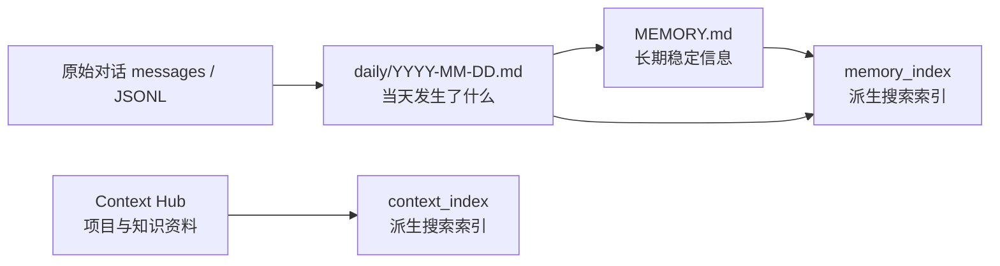
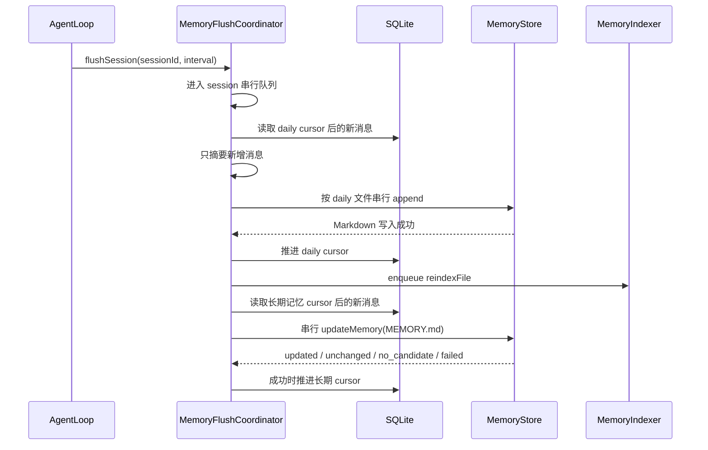

# little_claw Memory / Context 重设计方案（修订版）

## Summary
将系统拆成三类清晰职责：

- **Memory**：个人长期记忆与每日工作笔记，Markdown 是真相源。
- **Context Hub**：项目、领域、知识库资料，保留 L0/L1/L2 层次索引。
- **SQLite**：只做派生索引和搜索缓存，可删除重建，不是真记忆。

目标目录：

```text
~/.little_claw/
├── memory/
│   ├── MEMORY.md
│   ├── inbox.md
│   └── daily/YYYY-MM-DD.md
├── context-hub/
│   ├── 2-areas/
│   ├── 3-projects/
│   ├── 4-knowledge/
│   └── 5-archive/
└── logs/
    └── conversations/YYYY-MM-DD.jsonl
```

`context-hub/0-identity` 和 `context-hub/1-inbox` 废弃：不再自动创建、不再自动加载、不再写入、不再索引。旧文件 v1 只迁移复制，不删除。

## Key Changes

### Memory
- 新增 `MemoryStore` 管理 `~/.little_claw/memory/` 和 `~/.little_claw/logs/`。
- `memory/MEMORY.md` 是个人长期记忆真相源，替代 `context-hub/0-identity/profile.md`。
- `memory/inbox.md` 是待整理记忆候选，替代 `context-hub/1-inbox/inbox.md`。
- `memory/daily/YYYY-MM-DD.md` 是每日工作笔记，记录重要决策、完成事项、问题和可搜索上下文。
- `logs/conversations/YYYY-MM-DD.jsonl` 是原始流水，只用于审计、回放和后台整理，不参与默认 memory 语义。

### Context Hub
- `ContextHub` 只管理项目/资料库：
  - `2-areas`
  - `3-projects`
  - `4-knowledge`
  - `5-archive`
- `context_write` 只写 context-hub 项目/领域/知识文件。
- `context_index` 继续索引 `.overview.md`，保持 L0 `.abstract.md` → L1 `.overview.md` → L2 文件的读取模型。
- 任何 **project-scoped execution** 都必须进入 context-hub 体系。

### Project-Scoped Execution
以下执行都视为 project-scoped：

- Mission Control `/mission-control/channels` 中 project channel 的直接消息。
- project channel 中 `@agent` 的消息。
- project task。
- project schedule。
- coordinator 在 project channel 中回复。
- 任何带 `project` 或 project channel 归属的后台执行。

project-scoped run 每轮开始必须加载：

```text
projectChannel.contextPath
```

如果 channel 没有显式 `contextPath`，默认使用：

```text
context-hub/3-projects/{project}
```

并读取：

```text
{projectContextPath}/.overview.md
```

L2 文件仍然按需通过 `context_read` 读取，不默认全量加载项目目录。

### Tools / Protocol
- `memory_read`：只读 `memory/`，例如 `MEMORY.md`、`inbox.md`、`daily/2026-07-11.md`。
- `memory_write`：只写 `memory/`，默认追加 `daily/YYYY-MM-DD.md` 或 `inbox.md`；更新 `MEMORY.md` 前必须先读现有内容。
- 新增 `context_read`：只读 `context-hub/...`。
- `context_write`：拒绝写 `0-identity/...` 和 `1-inbox/...`。
- `memory_search`：搜索 memory Markdown 索引。
- `context_search`：搜索 context-hub overview 索引。
- `memory_clear` 改名或降级为索引操作，避免误导为删除真实记忆。

## Index & Embedding Lifecycle

### 索引表
新增 `memory_index` 表，索引 memory Markdown 文件：

```text
id
source_path
source_kind        # memory | inbox | daily
chunk_index
content
file_hash
chunk_hash
keywords
embedding
embedding_signature
updated_at
```

调整 `context_index`，显式保存：

```text
dir_path
overview_content
content_hash
keywords
embedding
embedding_signature
updated_at
```

规则：`file_hash/chunk_hash/content_hash` 表示文本内容；`embedding_signature` 表示 embedding provider/model/baseURL/dimensions。两者任一变化，都需要重新 embedding。

### 服务启动时
启动时执行索引校验，但只对 stale 内容重新 embedding：

1. 初始化 `MemoryStore`，确保 `MEMORY.md`、`inbox.md`、`daily/`、`logs/conversations/` 存在。
2. 执行 `MemoryIndexer.indexAll()`：
   - 扫描 `MEMORY.md`、`inbox.md`、`daily/*.md`。
   - 文件不存在则删除对应 `memory_index` rows。
   - 文件 hash 未变且 `embedding_signature` 未变：跳过。
   - 文件 hash 变了：删除该文件旧 chunks，重新切 chunk、提取 keywords、计算 embedding。
   - `embedding_signature` 变了：即使文件未变，也重新计算该文件所有 chunks 的 embedding。
3. 执行 `ContextMetaGenerator.scanAndGenerate()`：
   - 只处理 `2-areas`、`3-projects`、`4-knowledge`、`5-archive`。
   - 不处理废弃的 `0-identity`、`1-inbox`。
4. 执行 `ContextIndexer.indexAll()`：
   - 扫描参与索引目录的 `.overview.md`。
   - overview 内容未变且 `embedding_signature` 未变：跳过。
   - overview 内容变了或 embedding 签名变了：重新提取 keywords、重新 embedding。
   - 目录不存在或 overview 删除：删除对应 `context_index` row。

### 首次迁移后
迁移完成后立即重建索引：

1. 复制 `context-hub/0-identity/profile.md` 到 `memory/MEMORY.md`。
2. 复制 `context-hub/1-inbox/inbox.md` 到 `memory/inbox.md`。
3. 复制旧 `memory/YYYY-MM-DD.md` 到 `memory/daily/YYYY-MM-DD.md`。
4. 复制旧 `memory/YYYY-MM-DD.jsonl` 到 `logs/conversations/YYYY-MM-DD.jsonl`。
5. 执行 `MemoryIndexer.rebuildAll()`。
6. 执行 `ContextIndexer.rebuildAll()`，排除 `0-identity`、`1-inbox`。
7. 旧文件保留，但新系统不再读写和索引。

### Memory 写入后
任何 memory Markdown 写入后都做局部索引更新：

- `memory_write("MEMORY.md")` 成功后：`MemoryIndexer.reindexFile("MEMORY.md")`。
- `memory_write("inbox.md")` 成功后：`MemoryIndexer.reindexFile("inbox.md")`。
- `memory_write("daily/YYYY-MM-DD.md")` 成功后：`MemoryIndexer.reindexFile("daily/YYYY-MM-DD.md")`。
- 如果写入内容与原文件完全相同：不更新 `updated_at`，不重新 embedding。

### Context 写入后
`context_write` 写 L2 文件后按受影响目录局部更新：

1. 写入目标 L2 文件。
2. 刷新直接目录和必要父目录的 `.abstract.md` / `.overview.md`。
3. 对每个被刷新目录执行 `ContextIndexer.reindexDir(dirPath)`。
4. 只 embedding `.overview.md`，不默认 embedding L2 全文。
5. 如果 refreshed overview 内容未变且 `embedding_signature` 未变：跳过 embedding。

### 自动 daily note flush 后
在以下时机生成或追加 `memory/daily/YYYY-MM-DD.md`：

- 每 5 轮对话后。
- session switch。
- idle cleanup。
- server shutdown。
- compaction 前。

flush 成功后只调用：

```text
MemoryIndexer.reindexFile("daily/YYYY-MM-DD.md")
```

不再把摘要直接写入旧 `memory_embeddings`。

### 长期记忆提取后
`LongTermMemoryExtractor` 的目标文件是 `memory/MEMORY.md`：

- 输入：当前 `MEMORY.md` + 新增 user/assistant 对话摘要或 daily note。
- 输出：完整合并后的 `MEMORY.md`，或 `NONE`。
- 如果输出 `NONE` 或内容无变化：不写文件，不更新索引。
- 如果写入 `MEMORY.md`：调用 `MemoryIndexer.reindexFile("MEMORY.md")`。

### 手动 rebuild 命令
提供两个明确命令：

- `memory_rebuild_index`
  - 删除并重建 `memory_index`。
  - 不改任何 Markdown 文件。
- `context_rebuild_index`
  - 刷新 context-hub 元文件。
  - 删除并重建 `context_index`。
  - 不改 L2 用户内容，除 `.abstract.md` / `.overview.md` 元文件外。

### Embedding 配置变化
所有索引 row 必须记录 `embedding_signature`。

`embedding_signature` 至少包含：

```text
provider
model
baseURL
dimensions
normalization/version
```

规则：

- 当前 signature 与 row signature 不同：该 row stale。
- stale row 重新 embedding。
- 不允许把不同 embedding signature 的 rows 混在一次检索结果里。
- 如果 embedding provider 不可用：
  - 启动不失败。
  - 保留旧索引。
  - 搜索降级为 BM25-only。
  - provider 恢复时再补 embedding。

## Read / Write Timing

### 每轮开始
- `contextMode === "off"`：
  - 不加载 `MEMORY.md`。
  - 不检索 `memory_index`。
  - 不检索 `context_index`。
- 普通 chat，无 project 归属：
  - 加载预算内 `memory/MEMORY.md`。
  - 检索 `memory_index`，默认 topK=2。
  - 不自动加载 context-hub。
- 用户提到“记得/之前/上次/记忆/remember/recall”：
  - 检索 `memory_index`，默认 topK=5。
  - 不自动读 context-hub，除非明确提到项目/资料库，或当前执行本身是 project-scoped。
- project-scoped execution：
  - 加载极简 `MEMORY.md`。
  - 加载 `projectChannel.contextPath ?? context-hub/3-projects/{project}` 的 `.overview.md`。
  - 检索 `context_index`，优先当前项目，再扩展到相关 `2-areas` / `4-knowledge`。
  - L2 文件只通过 `context_read` 按需读取。
- 用户提到“项目/context-hub/资料库/知识库”：
  - 检索 `context_index`。
  - 根据 L1 overview 决定是否 `context_read` L2。

### 对话中
- 保存个人偏好、长期协作事实、用户明确要求记住的内容：
  - 写 `memory/MEMORY.md` 或 `memory/inbox.md`。
- 记录当天完成事项、决策、问题：
  - 写 `memory/daily/YYYY-MM-DD.md`。
- 保存项目资料、状态、研究材料、可复用知识：
  - 写 `context-hub/2-areas`、`3-projects`、`4-knowledge`。
- 读取 memory：
  - 用 `memory_read`。
- 读取 context-hub：
  - 用 `context_read`。

### 每轮结束
- 原始消息和工具事件追加到 `logs/conversations/YYYY-MM-DD.jsonl`。
- 不自动把原始 JSONL 写入 memory index。
- 不自动把整轮对话直接写入长期 memory。

## Implementation Steps

1. 建立 `MemoryStore`，拆分 `memory/`、`logs/` 与 `context-hub/` 的职责。
2. 改造 `ContextHub`，停止创建和索引 `0-identity`、`1-inbox`。
3. 增加迁移逻辑，复制旧 identity/inbox/daily/log 文件到新位置。
4. 新增 `MemoryIndexer` / `MemoryRetriever`，实现 Markdown chunk、BM25 keywords、embedding、stale 检测。
5. 调整 `ContextIndexer`，显式保存 `embedding_signature` 并排除废弃目录。
6. 改造 project context 解析：
   - 所有带 `project` 的 execution 都设置 `projectContextPath`。
   - 优先使用 `ProjectChannel.contextPath`，否则 fallback 到 `context-hub/3-projects/{project}`。
7. 改造 `MemoryManager`：
   - `saveDailyLog()` 写 `logs/conversations/`。
   - `saveSummary()` 替换为 daily note flush。
   - 自动 recall 改用 `MemoryRetriever`。
8. 将 `IdentityExtractor` 改为 `LongTermMemoryExtractor`，目标改为 `memory/MEMORY.md`。
9. 调整工具：
   - `memory_read/write` 限定 memory。
   - 新增 `context_read`。
   - `context_write` 拒绝废弃路径。
10. 调整 Gateway / CLI / UI：
   - `memory_search` 搜 `memory_index`。
   - `context_search` 搜 `context_index`。
   - Memory 页面展示 `MEMORY.md`、`inbox.md`、daily notes。
11. 更新 agent guidance，明确 Memory 与 Context Hub 的边界。

## Test Plan

- 启动时创建新目录结构。
- 旧 `profile.md` 迁移到 `memory/MEMORY.md`，旧文件保留。
- 旧 inbox 迁移到 `memory/inbox.md`，旧文件保留。
- 旧 daily `.md` 迁移到 `memory/daily/`。
- 旧 `.jsonl` 迁移到 `logs/conversations/`。
- `MemoryIndexer.indexAll()` 对未变化文件不重复 embedding。
- 文件内容变化后只 reindex 对应文件。
- embedding signature 变化后重新 embedding。
- embedding provider 不可用时搜索降级为 BM25-only。
- `context_write` 后只 reindex 受影响 overview。
- `memory_read("context-hub/...")` 返回明确错误。
- `context_read("memory/...")` 返回明确错误。
- 普通 chat 加载 Memory，不加载 Context Hub。
- Mission Control project channel 直接消息加载对应 project overview。
- project channel 中 `@agent` 消息加载对应 project overview。
- project task / schedule / coordinator project 回复都加载对应 project overview。
- 如果 project channel 配置了 `contextPath`，优先使用该路径。
- 每轮结束写 logs，不写 memory index。
- 每 5 轮 flush daily note 并更新 `memory_index`。
- `memory_search` 返回 Memory Markdown chunks。
- `context_search` 返回 Context overview 结果。

## Assumptions
- v1 不删除旧用户文件，只迁移复制并停止使用旧路径。
- Markdown 文件是唯一记忆真相源。
- SQLite 索引可以随时删除重建。
- Context Hub 只做项目/领域/知识库，不再承载个人身份和 inbox。
- 任何带 project 归属的执行都属于 project-scoped execution。
- 旧 `memory_embeddings` 不再接受新写入，后续版本再移除。


# 问题
可以先把整套系统理解成四层：



- 原始对话：完整流水，可审计。
- Daily：当天做了什么、有哪些决定。
- `MEMORY.md`：用户偏好、身份、长期协作事实。
- SQLite index：只是为了搜索，删掉也能从 Markdown 重建。

现在的问题主要出现在“怎么把原始对话安全地整理进 daily/MEMORY”和“怎么安全地更新索引”。

---

## 1. 多个会话同时写，会丢记忆

### 现在的问题

当前追加 daily 的实际过程是：

1. 读取现有文件内容。
2. 在内存里拼上新内容。
3. 用新内容覆盖整个文件。

假设今天的 daily 原来是：

```text
已有内容
```

Session A 和 Session B 同时 flush：

```text
A 读到：已有内容
B 读到：已有内容

A 准备写：已有内容 + A 的摘要
B 准备写：已有内容 + B 的摘要
```

如果 A 先写、B 后写，最后文件会变成：

```text
已有内容 + B 的摘要
```

A 的摘要丢了。

`MEMORY.md` 更危险，因为它的更新过程是：

```text
读取旧 MEMORY
→ 调 LLM 生成新的完整 MEMORY
→ 覆盖文件
```

两个 Agent 同时执行时，后写的 LLM 结果可能完全覆盖先写入的新事实。

### 解决方法

设置两层串行队列：

#### 第一层：同一个 session 的 flush 串行

同一个 session 不能同时触发“五轮 flush”和“session switch flush”。

```text
session-1 flush A
        ↓ 完成
session-1 flush B
```

#### 第二层：同一个文件的写入串行

不同 session 最终都可能写今天的 daily 或同一个 `MEMORY.md`，因此还要按文件排队：

```text
daily/2026-07-11.md:
  session-A append
        ↓
  session-B append
        ↓
  session-C append
```

`MEMORY.md` 也必须排队，并且要把整个 LLM 合并放在队列里面：

```text
任务 A：
  读取 MEMORY
  → LLM 合并 A 的事实
  → 写入

任务 B：
  读取任务 A 刚写完的 MEMORY
  → LLM 再合并 B 的事实
  → 写入
```

这样 B 一定能看到 A 的修改。

此外：

- append 使用真正的追加写入。
- overwrite 先写临时文件，再 rename。
- 防止进程崩溃时留下只写了一半的 `MEMORY.md`。

---

## 2. Daily 会重复摘要同一批对话

### 现在的问题

现在每五轮调用一次 `saveSummary()`，但传入的是完整对话。

例如：

```text
第 5 轮：
摘要消息 1～5
写入 daily

第 10 轮：
摘要消息 1～10
再次写入 daily

session switch：
又摘要消息 1～10
再次写入 daily

shutdown：
再摘要消息 1～10
再次写入 daily
```

最终 daily 里会有大量重叠内容。

这不仅浪费 LLM token，还会导致搜索时同一件事被召回很多遍。

### 解决方法

在 SQLite 中记录每个 session 已经处理到哪条消息。

例如：

```text
memory_flush_state

session_id: session-A
daily_cursor_message_id: message-5
long_term_cursor_message_id: message-3
```

这表示：

- Daily 已处理到 message 5。
- 长期记忆只处理到 message 3。

下一次 daily flush 只读取：

```text
message 6 ～ 最新消息
```

而不是重新读取 message 1～最新消息。

### 为什么要两个 cursor

因为 daily 和长期记忆可能部分成功。

例如：

```text
新消息：message 6～10

daily 写入成功
MEMORY 的 LLM 调用失败
```

此时应该变成：

```text
daily_cursor = message 10
long_term_cursor = message 3
```

下次：

- Daily 不会重复处理 6～10。
- 长期记忆仍会重试 4～10。

如果只有一个 cursor，就无法表示这种部分成功状态。

---

## 3. 文件写成功、Cursor 没更新，会重复写

### 现在的问题

Markdown 文件和 SQLite 是两个不同的存储系统，不能放进同一个事务。

可能发生：

```text
1. Daily 文件写入成功
2. 进程崩溃
3. SQLite cursor 还没更新
```

重启后系统看到旧 cursor，以为这批消息没有处理，于是再次追加同样的摘要。

### 解决方法

给每次 daily flush 生成稳定 ID：

```text
sha256(sessionId + firstMessageId + lastMessageId + version)
```

写入 daily 时同时写一个隐藏标记：

```html
<!-- little-claw:daily-flush id="abc123" -->
```

重启后再次处理同一批消息时：

1. 先计算同一个 flush ID。
2. 检查 daily 是否已经有这个标记。
3. 如果有，不再追加。
4. 只补齐 SQLite cursor。

所以执行顺序变成：

```text
生成 flush ID
→ 检查是否已经写过
→ 没写过才 append
→ 更新 cursor
```

这保证同一批消息最多写一次。

---

## 4. LLM 失败和“没有值得记住的内容”无法区分

### 现在的问题

当前 `LongTermMemoryExtractor` 遇到两种情况都会返回：

```ts
{ updated: false }
```

两种情况分别是：

- LLM 正常判断：没有值得写进长期记忆的内容。
- LLM API 调用失败。

上层看到的结果一样，所以可能把失败的消息也标成已处理，之后不再重试。

### 解决方法

把返回值改成明确状态：

```ts
type LongTermMemoryResult =
  | { status: "updated" }
  | { status: "unchanged" }
  | { status: "no_candidate" }
  | { status: "failed"; error: string };
```

处理规则：

| 状态 | 是否推进长期记忆 cursor |
|---|---:|
| `updated` | 是 |
| `unchanged` | 是 |
| `no_candidate` | 是 |
| `failed` | 否 |

这样临时网络错误不会造成永久遗漏。

同时删除当前的 `lastDistilledCount` 内存计数，因为它：

- 重启后会消失。
- LLM 失败时可能提前推进。
- 无法处理多个 flush 来源。

以后只认 SQLite cursor。

---

## 5. Team Task 和 Coordinator 通常不会生成 Daily

### 现在的问题

“五轮自动 flush”的计数器属于一个 `AgentLoop` 实例。

普通 chat 的 AgentLoop 会被复用很多轮，所以能到第五轮。

但 Team Task 和 Coordinator 通常是：

```text
收到一个任务
→ 创建新的 AgentLoop
→ 执行一轮
→ AgentLoop 被销毁
```

下一次任务又创建一个新的 AgentLoop，计数重新从零开始。因此它们几乎永远到不了第五轮。

Session switch、idle、shutdown 又只管理普通 chat session，不能补救 coordinator 的短生命周期执行。

### 解决方法

使用两类触发策略：

#### 长生命周期 Chat

保留：

- 每五个完整对话回合。
- session switch。
- idle cleanup。
- shutdown。

#### 短生命周期执行

以下执行在结束时强制 flush：

- Team Task。
- Project Task。
- Schedule Task。
- Agent DM。
- Coordinator 回复。

即：

```text
执行完成
→ flushSession(reason="execution_end", force=true)
```

另外 Coordinator 目前使用临时 Conversation，需要改成数据库 Conversation：

```ts
Conversation.createNew(db, prompt, "coordinator_run")
```

这样 Coordinator 的消息才能：

- 有稳定 session ID。
- 使用 cursor。
- 重启后恢复。
- 不会因为都是 `ephemeral` 而混在一起。

`coordinator_run` 不进入普通 chat session 列表。

---

## 6. 自定义项目 contextPath 没有贯穿完整流程

### 现在的问题

假设项目 slug 是：

```text
website
```

但用户给项目频道配置了：

```text
context-hub/3-projects/company-website
```

现在部分代码使用自定义路径：

```text
context-hub/3-projects/company-website
```

但另外一些代码仍然自己拼接：

```text
context-hub/3-projects/website
```

于是可能出现：

- AgentLoop 加载的是 `company-website/.overview.md`。
- Task prompt 却告诉 Agent 在 `website/` 工作。
- Shell cwd 在 `company-website/`。
- 最后的 `status.md` 又归档到了 `website/`。

这会让一个项目的数据被拆进两个目录。

### 解决方法

每次 execution 开始时，只解析一次项目执行上下文：

```ts
const projectExecutionContext = resolveProjectExecutionContext({
  project,
  channelId,
  projectChannels,
});
```

结果类似：

```ts
{
  project: "website",
  channelId: "...",
  projectContextPath: "context-hub/3-projects/company-website"
}
```

后续所有地方只能使用这个结果：

```text
Task prompt
Project overview
Shell cwd
Shell env
write_file
context_write guidance
审批恢复
status.md 归档
```

不允许这些模块再自行拼接 `3-projects/{project}`。

路径优先级固定为：

```text
ProjectChannel.contextPath
        ↓ 没有
context-hub/3-projects/{project}
```

如果数据库里的显式路径非法，应直接报错，不能悄悄回退到另一个目录，否则仍可能写错位置。

---

## 7. Embedding 失败时会破坏原本可用的索引

### 现在的问题

当前重新索引的顺序是：

```text
删除旧 rows
→ 生成新 embedding
→ 写新 rows
```

如果删除之后 embedding provider 挂了，就只会留下空向量。

更糟的是，一个文件可能有多个 chunk：

```text
chunk 1 embedding 成功
chunk 2 embedding 失败
chunk 3 embedding 成功
```

搜索会看到一个半成品索引。

### 解决方法

改成“先构建，后替换”：

```text
读取 Markdown
→ 在内存中生成全部 chunks
→ 生成全部 keywords
→ 尝试生成全部 embeddings
→ 所有新 rows 准备完
→ SQLite transaction 一次替换旧 rows
```

在 transaction 之前，数据库仍保留完整旧索引。

### Provider 失败时分两种情况

#### 情况 A：Markdown 内容没变，只是 embedding 配置变了

例如切换了 embedding model，但新 provider 暂时不可用。

处理方式：

```text
保留旧 row
保留旧 embedding
搜索临时只用 BM25
稍后重试新 embedding
```

不能为了更新模型而破坏仍然有效的关键词索引。

#### 情况 B：Markdown 内容已经变化

旧 embedding 对应的是旧文本，不能继续用于新内容。

处理方式：

```text
用新文本生成新的 keywords
写成 BM25-only rows
embedding 标记为 missing
```

这样至少新内容能被关键词搜索到，同时不会拿旧文本的向量冒充新文本。

#### 任意 chunk 失败

整个文件本轮都按 BM25-only 处理，不能只让部分 chunk 有新向量。

---

## 8. 不同 Embedding 版本不能放在一起比较

### 现在的问题

不同 embedding 模型生成的向量相当于使用不同坐标系。

例如：

```text
模型 A：1536 维
模型 B：1024 维
本地 hash：256 维
```

即使维度碰巧相同，不同模型的“0.8 相似度”也没有直接可比性。

当前虽然只对签名相同的 row 计算 vector score，但所有 row 最后仍进入固定的混合公式：

```text
0.3 × BM25 + 0.7 × Vector
```

BM25-only 文档没有 vector，于是最多只能拿到 30% 分数，会被不相关但有向量的旧文档压下去。

### 解决方法

分开生成两个排行榜：

#### BM25 排行榜

包括所有最新 Markdown rows：

```text
BM25 ranking:
1. 文档 A
2. 文档 C
3. 文档 B
```

#### Vector 排行榜

只包括满足以下条件的 rows：

```text
embedding_status = ready
signature = 当前 signature
dimensions = 当前 query dimensions
```

例如：

```text
Vector ranking:
1. 文档 B
2. 文档 A
```

然后用 RRF 合并两个“排名”，而不是直接混合不可比的绝对分数：

```text
最终：
1. 文档 A  // 两个榜都靠前
2. 文档 B  // vector 靠前
3. 文档 C  // 只有 BM25，但不会被乘成 30%
```

同时过滤完全不相关的结果：

```text
至少命中一个 BM25 token
或
vector score >= 0.4
```

自动 recall 还限制同一个文件最多返回一个 chunk，防止某一天的 daily 占满 topK。

---

## 9. 启动索引和写入索引会互相覆盖

### 现在的问题

服务启动时会后台执行 `indexAll()`。

假设：

```text
启动 indexAll 读取了旧 MEMORY
→ 正在等待 embedding API

此时用户 memory_write 写了新 MEMORY
→ reindexFile 写入了新索引

启动 indexAll 的旧 embedding 返回
→ 又把旧内容写回索引
```

最终 Markdown 是新的，但 SQLite 搜到的是旧的。

### 解决方法

每个 indexer 都只有一条 mutation 队列：

```text
MemoryIndexer queue:
  startup indexAll
      ↓
  memory_write reindex
      ↓
  manual rebuild
```

无论调用来自哪里，都必须排队。

如果 startup indexAll 先进入队列，那么用户写入触发的 reindex 一定后执行，最终索引一定是新的。

Rebuild 也不能先清空表再慢慢生成，而应：

```text
先完整构建新 rows
→ 最后一次 transaction 切换
```

搜索过程中只能看到：

- 完整旧索引，或
- 完整新索引。

不能看到空表或半成品。

---

## 10. Embedding Provider 恢复后需要自动补索引

### 现在的问题

现在 provider 失败后，只能等待：

- 下次重启。
- 用户手动 rebuild。
- 文件再次被写入。

如果服务一直运行，BM25-only rows 可能永远没有 embedding。

### 解决方法

只有发生 embedding 故障时，启动后台恢复循环：

```text
失败后 1 分钟重试
→ 再失败，5 分钟
→ 再失败，15 分钟
→ 后续每 15 分钟
```

一旦成功：

```text
重新扫描 missing/stale rows
→ 补齐 embedding
→ 停止恢复循环
```

恢复任务同样进入 indexer mutation queue，不能和写入、rebuild 并发。

服务 shutdown 时取消恢复 timer，并等待正在执行的索引任务结束。

---

## 11. Daily 日期和标题时间不一致

### 现在的问题

文件名使用 UTC：

```ts
new Date().toISOString().slice(0, 10)
```

但标题使用上海时间。

北京时间凌晨 01:00：

```text
UTC 日期：前一天 17:00
上海日期：当天 01:00
```

可能得到：

```text
daily/2026-07-10.md

## 01:00 - Conversation summary
```

内容实际属于 7 月 11 日，却写进 7 月 10 日文件。

### 解决方法

新增统一时间工具：

```ts
const APP_TIME_ZONE = "Asia/Shanghai";
```

一次 flush 开始时只取一次时间：

```ts
const now = clock.now();
```

后续全部由这个 `now` 生成：

```text
daily 文件名
daily 标题时间
inbox 日期
JSONL 文件名
metadata 时间
```

这样既不会混用 UTC，也不会在 23:59:59 跨午夜时出现文件名和标题来自不同日期。

测试中可以注入固定 clock，验证北京时间 00:30 的行为。

---

## 12. MEMORY 被重复注入，而且没有大小限制

### 现在的问题

普通对话目前会同时：

1. 加载完整 `MEMORY.md`。
2. 搜索 `memory_index`。
3. `memory_index` 又可能返回 `MEMORY.md` 的 chunk。

同一条偏好可能出现两遍：

```text
<memory_file>
用户喜欢简洁回答
</memory_file>

<long_term_memory>
用户喜欢简洁回答
</long_term_memory>
```

此外，TokenBudget 把 `MEMORY.md` 当作必须保留项。如果文件增长到很大，它可能：

- 挤掉对话历史。
- 挤掉项目 overview。
- 导致 system prompt 超限。

### 解决方法

按运行模式分配明确预算。

#### 普通 Chat

```text
MEMORY.md：最多 4,000 tokens
```

加载了这部分后，自动 recall 排除已经注入的相同内容。

如果用户明确问“你还记得之前……”，可以搜索没有进入 4,000 token 预算的其他 MEMORY chunks。

#### Project / Team

不加载完整 `MEMORY.md`，只针对当前任务检索最相关的个人记忆：

```text
最多 1,500 tokens
```

例如项目任务只需要：

```text
用户偏好 TypeScript
用户要求所有项目报告用中文
```

不需要把姓名、兴趣、其他项目历史全部塞进去。

#### Inbox

只有用户明确提到：

```text
inbox
收件箱
提醒
之前记下的事情
```

才加载，最多 1,000 tokens。

---

## 最终运行流程

改造后，一个普通 chat 第五轮完成时的完整流程是：



这里有三个关键保证：

1. Markdown 永远优先：索引失败不影响真实记忆写入。
2. Cursor 永远在文件成功后推进：不会把没写入的消息误标成已处理。
3. 所有写入和索引都有明确顺序：不会互相覆盖。

## 改造边界

这次解决的是单 Bun server 下的正确性：

- 不丢数据。
- 不重复摘要。
- 失败可以重试。
- Team/Coordinator 能进入记忆流水。
- 自定义项目路径全链路一致。
- Embedding 故障可降级和恢复。
- 上下文大小受控。

暂时不解决：

- 多个 server 进程共同写同一份 Memory。
- 超大规模向量数据库或 FTS。
- Daily 自动归档和保留期限。
- 升级时重新总结所有历史对话。


## 各组件分别是什么

| 组件 | 是什么 | 主要职责 |
|---|---|---|
| Markdown 文件 | 真正保存记忆的数据 | `MEMORY.md`、`inbox.md`、`daily/*.md` |
| `MemoryStore` | 文件存储管理器 | 创建、读取、追加、覆盖、迁移 Markdown 和 JSONL 文件 |
| `LongTermMemoryExtractor` | 长期记忆整理器 | 调 LLM，把新对话中的长期事实合并进 `MEMORY.md` |
| `MemoryIndexer` | 记忆索引构建器 | 读取 Markdown、切 chunk、提取关键词、生成 embedding、写入 SQLite |
| `MemoryRetriever` | 记忆搜索器 | 从 SQLite 的 `memory_index` 中进行 BM25 和向量搜索 |
| `MemoryFlushCoordinator` | 拟新增的流程协调器 | 控制哪些消息需要整理、避免重复、串行执行写入 |
| `MemoryManager` | AgentLoop 使用的上层入口 | 加载 Memory、触发 recall、调用 flush 流程 |

## MemoryStore 管理哪些真实文件

目录大致是：

```text
~/.little_claw/
├── memory/
│   ├── MEMORY.md
│   ├── inbox.md
│   └── daily/
│       └── 2026-07-11.md
└── logs/
    └── conversations/
        └── 2026-07-11.jsonl
```

例如：

```ts
memoryStore.readMemory("MEMORY.md")
```

实际读取的是：

```text
~/.little_claw/memory/MEMORY.md
```

而：

```ts
memoryStore.writeDailyNote(content)
```

实际写入的是：

```text
~/.little_claw/memory/daily/2026-07-11.md
```

所以关系是：

```text
MemoryStore（代码）
    ↓ 管理
MEMORY.md / inbox.md / daily/*.md（真实文件）
```

可以把 `MemoryStore` 理解成“文件管理员”。

## MemoryIndexer 是做什么的

对，`MemoryIndexer` 会生成 embedding，但它不只做 embedding。

完整工作是：

```text
读取 Markdown
→ 切分成 chunks
→ 计算文件 hash 和 chunk hash
→ 提取 BM25 关键词
→ 调 EmbeddingProvider 生成向量
→ 写入 SQLite memory_index
```

例如 `MEMORY.md` 内容是：

```markdown
# Memory

## 沟通偏好

- 用户偏好简洁、直接的回答。

## 技术偏好

- TypeScript 项目优先使用 Bun。
```

`MemoryIndexer` 可能把它切成两个 chunk：

```text
Chunk 0:
## 沟通偏好
- 用户偏好简洁、直接的回答。

Chunk 1:
## 技术偏好
- TypeScript 项目优先使用 Bun。
```

然后在 SQLite 里保存类似：

```text
memory_index
├── source_path: MEMORY.md
├── chunk_index: 0
├── content: 用户偏好简洁、直接的回答
├── keywords: 用户 偏好 简洁 直接 回答
├── embedding: [0.12, 0.38, ...]
└── embedding_signature: qwen3-embedding-8b...
```

注意：SQLite 里的这些内容不是最终真相，只是搜索缓存。

如果把 `memory_index` 表删了，可以重新读取 Markdown，再执行 `MemoryIndexer.indexAll()` 重建。

## MemoryRetriever 是做什么的

`MemoryRetriever` 不读取全部 Markdown，而是搜索 `MemoryIndexer` 建好的 SQLite 索引。

例如用户问：

```text
我之前说过希望你怎么回答问题？
```

搜索流程是：

```text
用户问题
   ↓
MemoryRetriever
   ├── BM25：匹配“之前、回答、希望”等关键词
   └── Vector：查找语义相近的 embedding
   ↓
返回最相关的 Memory chunks
```

可能返回：

```text
[MEMORY.md#0]
用户偏好简洁、直接的回答。
```

因此关系是：

```text
MemoryIndexer：负责建立目录
MemoryRetriever：负责查目录
```

## LongTermMemoryExtractor 和 MemoryIndexer 的区别

这两个很容易混淆。

### LongTermMemoryExtractor 修改真实记忆

它读取：

```text
旧 MEMORY.md
+
新对话
```

然后调用 LLM，输出新的完整 `MEMORY.md`。

例如：

```text
旧 MEMORY:
- 用户主要使用 TypeScript。

新对话:
用户说以后所有项目都优先用 Bun。

LLM 合并后:
- 用户主要使用 TypeScript。
- TypeScript 项目优先使用 Bun。
```

它负责的是“记忆内容应该写什么”。

### MemoryIndexer 只更新搜索索引

`MEMORY.md` 写完以后，MemoryIndexer 才运行：

```text
新的 MEMORY.md
→ chunks
→ keywords
→ embeddings
→ SQLite
```

它负责的是“以后怎样快速搜到这些内容”。

两者的顺序是：

```text
LongTermMemoryExtractor
        ↓ 修改
MEMORY.md
        ↓ 读取
MemoryIndexer
        ↓ 生成
memory_index
```

## MemoryFlushCoordinator 为什么需要新增

现在 `MemoryManager` 同时承担了太多事情：

- 判断什么时候摘要。
- 写 daily。
- 更新 `MEMORY.md`。
- 更新索引。
- 记录处理进度。

拟新增的 `MemoryFlushCoordinator` 专门负责整个流程和顺序。

例如第五轮对话结束：

```text
1. 查 SQLite cursor
   已处理到 message-5

2. 读取新增消息
   message-6 ～ message-10

3. 生成 daily 摘要

4. 让 MemoryStore 追加 daily Markdown

5. daily 写入成功后
   更新 daily cursor = message-10

6. 调 LongTermMemoryExtractor
   合并 MEMORY.md

7. MEMORY.md 成功或确认无需变化后
   更新 long-term cursor = message-10

8. 通知 MemoryIndexer
   重新索引变更的 Markdown 文件
```

它可以理解为“流水线调度员”。

## 最简单的整体关系

```text
原始对话
   │
   ▼
MemoryFlushCoordinator
   │
   ├── 生成当天摘要
   │       │
   │       ▼
   │   MemoryStore
   │       │
   │       ▼
   │   daily/2026-07-11.md
   │
   └── LongTermMemoryExtractor
           │
           ▼
       MemoryStore
           │
           ▼
       MEMORY.md

Markdown 写入完成
   │
   ▼
MemoryIndexer
   │
   ├── 切 chunk
   ├── 提取关键词
   └── 生成 embedding
           │
           ▼
     SQLite memory_index

下一轮用户提问
   │
   ▼
MemoryRetriever
   │
   ▼
搜索 memory_index
   │
   ▼
返回相关记忆给 Agent
```

一句话概括：

- `MemoryStore`：管文件。
- `LongTermMemoryExtractor`：决定长期记忆写什么。
- `MemoryIndexer`：把 Markdown 做成可搜索索引和 embedding。
- `MemoryRetriever`：搜索索引。
- `MemoryFlushCoordinator`：保证整个过程不重复、不并发覆盖、失败可重试。